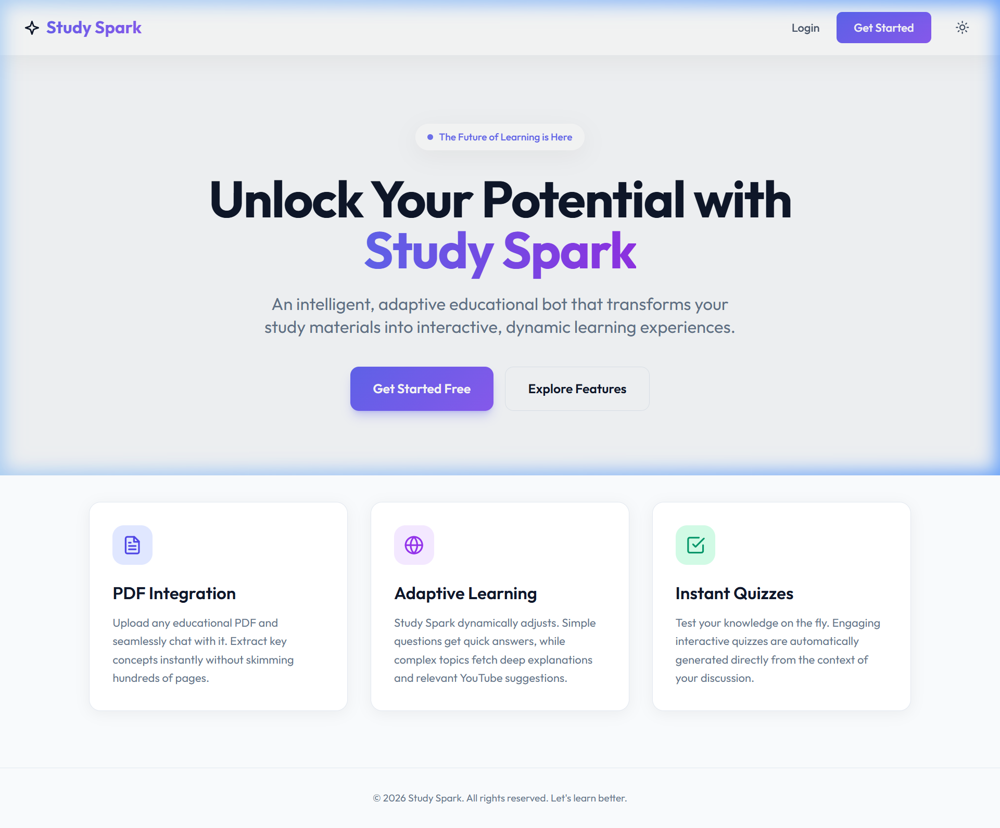
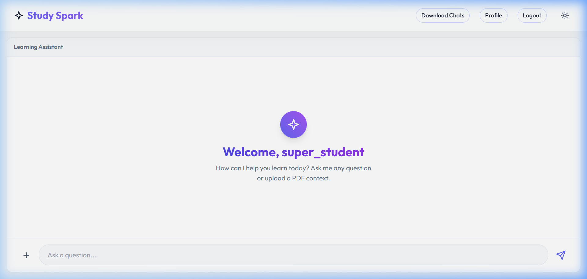
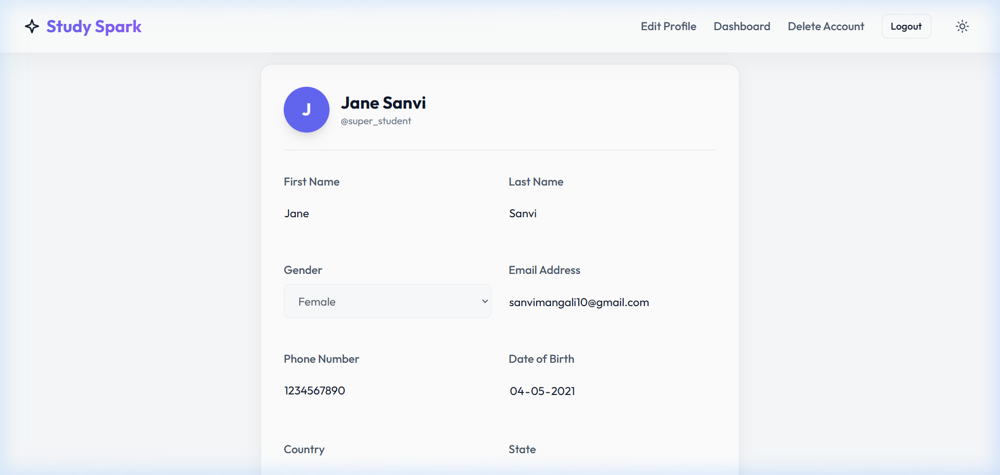

# Study Spark: The Demographic-Aware AI Educational Ecosystem

[](https://www.python.org/downloads/)
[](https://flask.palletsprojects.com/)
[](https://www.mongodb.com/)

Study Spark is a next-generation educational platform built to bridge the gap between generalized AI chatbots and deeply personalized learning. It doesn't just answer questions—it crafts comprehensive, curriculum-aligned learning experiences tailored specifically to the user's age, grade, location, and educational board.

---

## 🌟 Visual Showcase

### Landing Page
The first point of contact for users, showcasing the platform's core value proposition with a modern, glassmorphic design.


### Student Dashboard
A unified interface where students can interact with their PDF materials side-by-side with an intelligent AI tutor.


### User Profile
Detailed demographic management that powers the AI's adaptive response engine.


---

## 🚀 Key Features

### 1. Demographic-Aware RAG Pipeline
Unlike static chatbots, Study Spark adjusts its pedagogical approach based on:
- **Age & Grade**: Simplifies or deepens concepts accordingly.
- **Location & Board**: Adapts to specific regional syllabi (e.g., CBSE, ICSE, US Common Core).
- **Subject Context**: Matches the tone and complexity to the field of study.

### 2. Multi-Tiered AI Explanations
Every query generates a structured response optimized for different learning stages:
- **ELI5 (Explain Like I'm 5)**: High-level conceptual overview.
- **Deep Dive**: Thorough, detailed explanations for core understanding.
- **Revision Points**: Bulleted "must-know" facts for quick review.

### 3. Native PDF Interaction
Upload textbooks or lecture notes to chat directly with documents. The system uses a custom search engine to retrieve relevant context, ensuring answers are grounded in your specific curriculum.

### 4. Interactive Assessment & Multimedia
- **Auto-Generated Quizzes**: Immediate self-assessment based on the current topic.
- **Curated YouTube Resources**: Dynamically fetched video recommendations to supplement visual learning.

---

## 👥 User Roles & Permissions

| Role | Permissions | Use Case |
| :--- | :--- | :--- |
| **Student** | Full access to chat, PDF uploads, quizzes, and history. | Primary learner using the bot for study assistance. |
| **Educator / HOD** | Profile-based adaptation for content level (Planned: Content management). | Faculty monitoring student progress or preparing simplified materials. |
| **Admin** | Full system oversight and user management. | System maintenance and data auditing. |

---

## 🛠️ Technical Stack

### **Backend**
- **Core Framework**: [Flask](https://flask.palletsprojects.com/) (Python)
- **Authentication**: JWT (JSON Web Tokens) via `Flask-JWT-Extended`
- **Session Management**: Secure, HTTPOnly Cookies
- **Database**: [MongoDB](https://www.mongodb.com/) (NoSQL) with `Flask-PyMongo`

### **Frontend**
- **Structure**: Semantic HTML5
- **Styling**: Vanilla CSS (Custom Glassmorphism and Responsive Design)
- **Logic**: Vanilla JavaScript (Fetch API for asynchronous data flow)

### **AI & NLP**
- **Core LLM**: Google Gemini API
- **Document Processing**: PyMuPDF (Fitz) for PDF extraction
- **Pipeline**: Custom orchestration engine for Query Classification and Response Building

---

## 📂 Project Structure

```text
edu_bot/
├── apis/                # API route definitions (Blueprint architecture)
│   └── query.py         # Main AI query and PDF upload endpoints
├── core/                # Core business logic & database managers
│   ├── main_pipeline.py # Orchestrates the AI's "Brain" (NLP & RAG)
│   └── db_services.py   # MongoDB integration and Auth logic
├── services/            # Specialized service modules
│   ├── pdf_ops.py       # PDF parsing and similarity search
│   ├── yt_recommendations.py # YouTube API integration
│   └── query_classifier.py # Demographic-based intent analysis
├── static/              # CSS, JavaScript, and Image assets
├── templates/           # Flask/Jinja2 HTML templates
├── assets/              # Documentation assets (Screenshots)
├── .env                 # Environment variables (API Keys, DB URI)
├── config.py            # Global application configuration
└── app.py               # Main Flask application entry point
```

---

## 🔒 Security Measures

1. **Authentication**: Robust JWT authentication stored in secure cookies prevents common session hijacking.
2. **Password Integrity**: Uses `werkzeug.security` for salt-based password hashing (PBKDF2).
3. **Data Isolation**: User demographics and chat histories are strictly isolated at the database query level.
4. **Input Sanitization**: Multi-layer validation for PDF uploads and query strings.
5. **Environment Safety**: Sensitive API keys and secret tokens are managed via encrypted `.env` variables.

---

## ⚙️ Quick Setup Guide

### 1. Prerequisites
- Python 3.8 or higher.
- A MongoDB instance (Local or Atlas).
- A Google Gemini API Key.

### 2. Installation
```bash
# Clone the repository
git clone <repository-url>
cd edu_bot

# Create and activate virtual environment
python -m venv venv
# Windows: venv\Scripts\activate | macOS/Linux: source venv/bin/activate

# Install dependencies
pip install -r requirements.txt
```

### 3. Configuration
Create a `.env` file in the root directory:
```env
GOOGLE_API_KEY="your_gemini_api_key"
DB_ADDR="mongodb://localhost:27017/"
FLASK_SECRET_KEY="your_secret_key"
YOUTUBE_API_KEY="your_youtube_api_key"
```

### 4. Run the Application
```bash
python app.py
```
Visit `http://localhost:5000` to start exploring!

---

## 📝 Demo Notes
- **Account Creation**: Use the "Get Started" button on the home page to create a profile. Your demographic details will immediately influence the bot's tone and complexity.
- **PDF Uploads**: Ensure PDF files are text-readable for optimal RAG performance.

---

## 🔮 Future Enhancements
- [ ] **Collaborative Study Rooms**: Real-time peer-to-peer study sessions.
- [ ] **Teacher Feedback Loop**: Allowing educators to verify AI-generated answers.
- [ ] **Mobile Application**: Native iOS/Android apps for learning on the go.
- [ ] **Voice Interaction**: Speech-to-text integration for accessibility.

---
*Built with passion to empower the next generation of global learners.*
